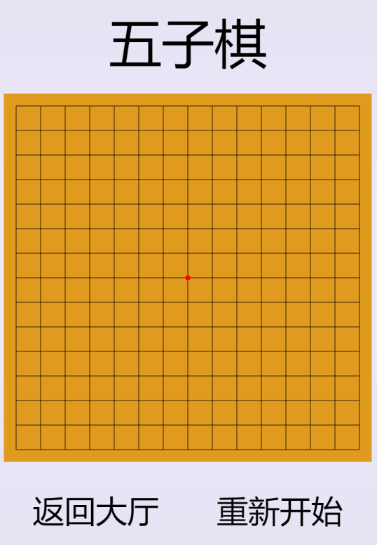
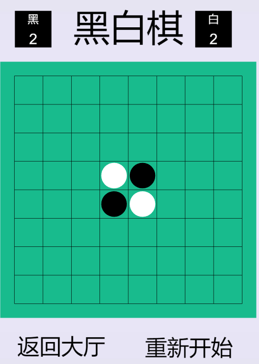
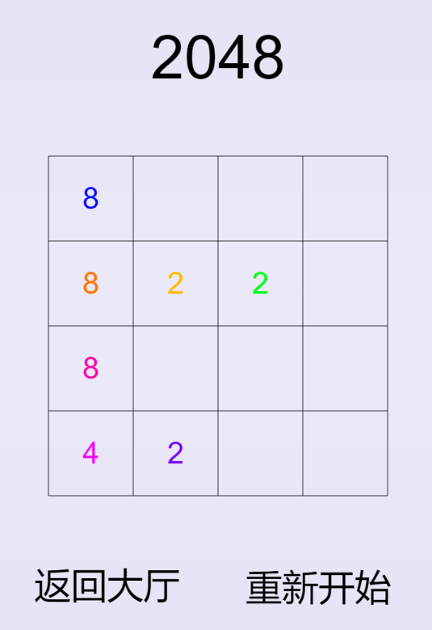
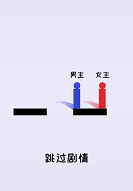
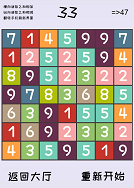
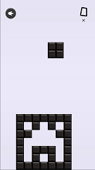
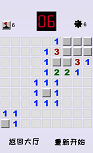

# so-many-games

**电脑端试玩**

[https://potato47.github.io/so-many-games/desktop/](https://potato47.github.io/so-many-games/desktop/)

**手机端扫描关注微信公众号[新手程序员]，菜单栏点击“游戏机"进入游戏**

------

|      游戏       |                    玩法                    |                 截图                 |   完成时间    |
| :-----------: | :--------------------------------------: | :--------------------------------: | :-------: |
|   **人机五子棋**   |            人机对战，电脑白棋后手，水平幼儿园             |    | 2018.2.17 |
|   **人机黑白棋**   |             人机对战，电脑白棋后手，水平初中             |   | 2018.2.19 |
| **2048丨程序员版** |     手势操作，上下左右，相同数字碰见合并，不封顶，不能滑动游戏结束      |     | 2018.2.22 |
|  **跳一跳丨言情版**  |             长按屏幕蓄力跳。故事结尾让人流泪             |      | 2018.3.4  |
| **拼图丨新垣结衣版**  |                向程序员们的老婆致敬                |     | 2018.3.6  |
|   **Get47**   | 原创消除，横向消除数字之和与分数相加，纵向消除数字之和与分数相减，分数等于47游戏结束，翻转手机重置视图 |      | 2018.3.8  |
|   **俄罗斯方块**   |      史上最难俄罗斯方块！手机端手势操作，电脑端上下左右wasd       |  | 2018.3.21 |
|   **扫雷丨闯关版**   |  从一个雷递增，只有最无聊的那个人才能通关。点击掀开，长按插旗       |  | 2018.4.3 |